# Python Turtle is a drawing tool based on Logo, an educational programming language developed in the 1960s. Logo was used widely in school computer labs in the '80s and '90s.

Here's how it works: The user types lines of code to control a cursor onscreen, typically represented as a turtle. The turtle can draw lines and curves as it walks around, creating geometric art. The next step is to add a loop to your code, letting you repeat the instructions as many times as you want.

We'll be using Python, a programming language that comes preinstalled with many computer operating systems. Python is really cool! It's relatively easy to learn, and it's used widely by scientists, web developers, hackers, and just about everyone else.

In this workshop we'll be focusing on **turtle**, a module that comes built-in with Python.

We'll also use **IDLE**, a program that lets you write and run Python code.

At the Iffy Books computer lab we're using the Linux-based operating system **Ubuntu**. If you're getting started on your home computer, skip ahead to the section titled **<u>Using Python Turtle at Home</u>**. Once **Python 3**, **IDLE**, and **Tkinter** are installed, you can resume here.

## ▶ Open IDLE

❏ Start by opening the **terminal** application. Click the grid icon at the bottom left corner of the screen and search for "terminal," or click the terminal icon in the application bar.

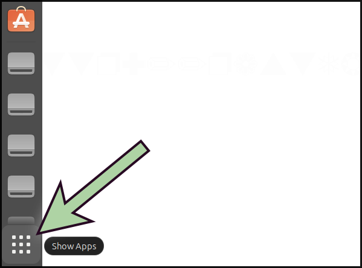<br />

❏ Type `idle` in the terminal and press **enter** to launch **IDLE**. 

↳ If you're using macOS, you may need to use the command `idle3`instead.

When IDLE launches, you'll see a command prompt with three angle brackets (**>>>**) on the left side.

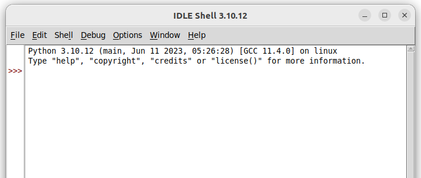

## 

## ➡ First Steps

❏ In the Idle command prompt, type the following command and press **enter**. Nothing will happen, which is normal. 

```
from turtle import *
```

You've just imported a collection of functions from the `turtle` module, which we'll be using for the rest of this workshop.

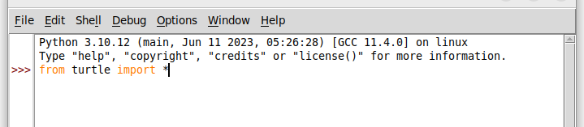

❏ Type the command below and press **enter**. You'll see a window pop up with a tiny turtle on a white background.

```
shape('turtle')
```

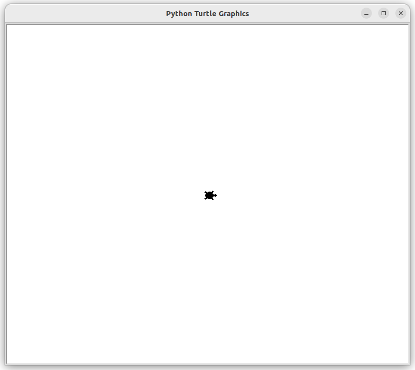

<div style="page-break-after: always;"></div>

❏ Run this command to make the turtle walk forward 100 steps, leaving a line behind it as it goes:

```
forward(100)
```

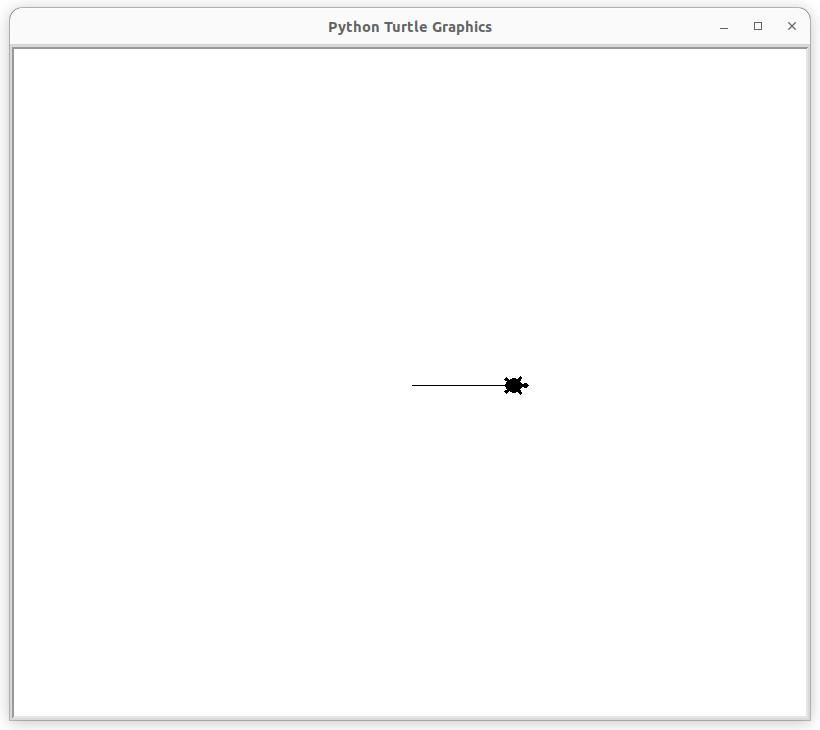<br />

❏ Now use the `left()` function to make your turtle turn left 90 degrees.

```
left(90)
```

❏ Walk forward another 100 steps with `forward()`.

```
forward(100)
```

❏ If you want to reset everything and go back to the beginning, you can use `reset()`.

```
reset()
```

❏ Try using `right(90)` and `back(100)` and see what happens. Now try `right(360)` and `back(600)`.

### 🐢 Mini challenge

**❏ *Drawing a square or rectangle.***

### 🐢 Mini challenge

**❏ *Draw an equilateral triangle (all three sides the same length).***

## ▶ Pen Up and Pen Down

So far your turtle has been in **pen down** mode, which means it draws a line wherever it goes. Next you'll learn to use **pen up** mode to move around without leaving a mark. You'll also learn to draw **circles**.

❏ Run the `reset()` command to clear the canvas.

```
reset()
```

<div style="page-break-after: always;"></div>

❏ Now run the following command to draw a circle with radius 30.

```
circle(30)
```

❏ Run the following commands one at a time and watch what happens:

```
penup()
forward(100)
pendown()
circle(50)
```

### 🐢 Mini challenge

**❏ *Draw a series of circles that get smaller from left to right. If you make a mistake, you can use `reset()` to clear the canvas.***

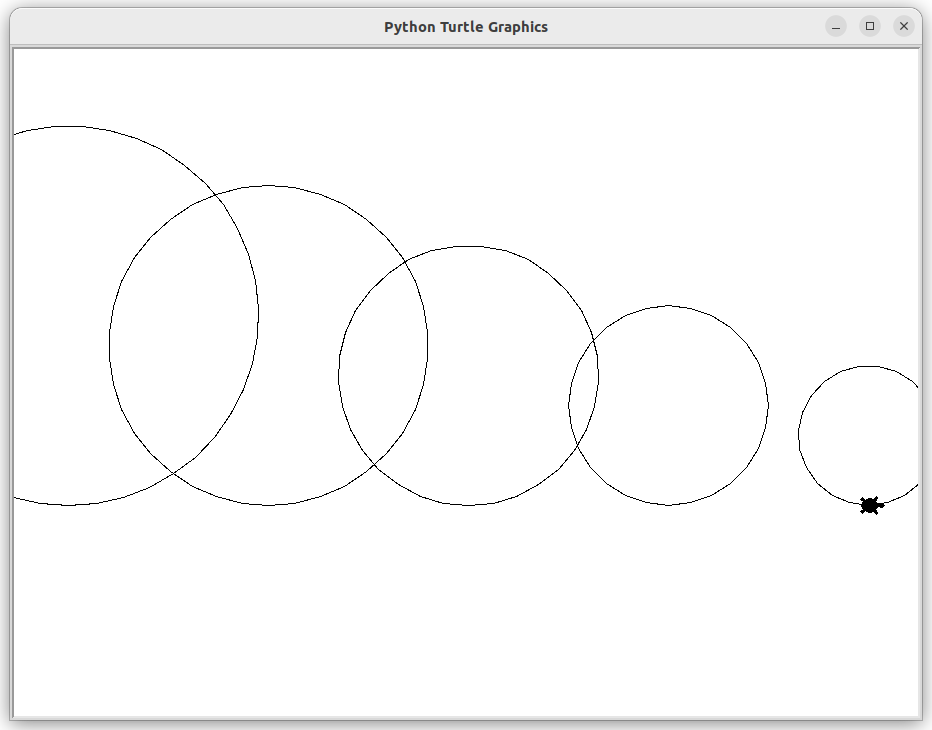<br />

## ▶ Start editing a .py file

So far you've been running one line of code at a time, which is a good way to learn the basics. The next step is to write several lines of code and run them all at once. To do that, you'll need to store your code in a **.py** file.

❏ In the toolbar, go to **File > New File**.

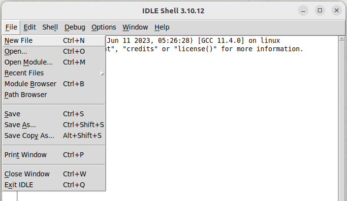<br />

<div style="page-break-after: always;"></div>

❏ A new text editor window will pop up. Type the lines below.

```
from turtle import *
shape('turtle')
forward(100)
```

❏ Go to **Run > Run Module** in the toolbar.

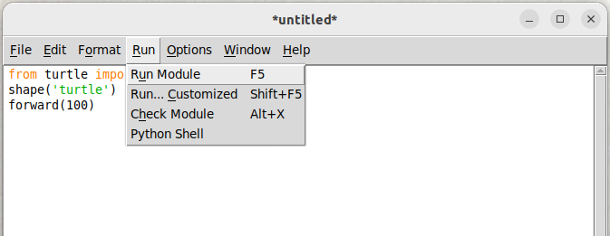<br />

❏ You'll be prompted to save your file before running it. Click **OK**.

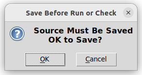<br />

<div style="page-break-after: always;"></div>

❏ Choose a filename and save your **.py** file somewhere memorable.

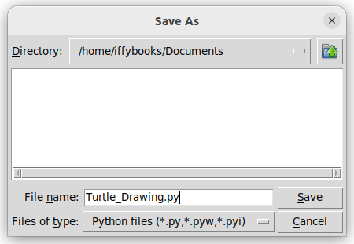<br />

Once your file is saved, your turtle drawing will get started.

<br />

Note that there's some text output in the IDLE shell window where you were typing commands earlier. If you get an error, you can check this window for details.

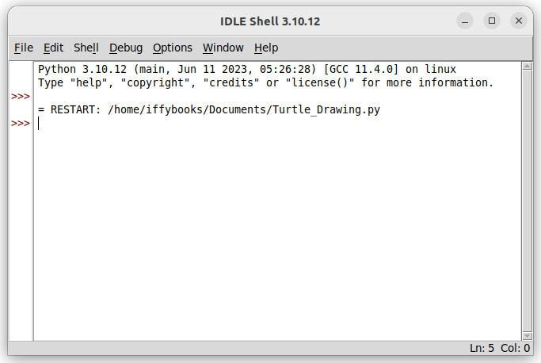<br />

## ▶ Change Colors & Line Width

❏ Add the line `width(5)` to your code to make your line thicker. Go to **Run > Run Module** in the toolbar or press **F5** to run your code.

```
from turtle import *
shape('turtle')
width(5)

circle(200)
```

❏ Now add the line `color('purple')` to make the line purple. Go to **Run > Run Module** in the toolbar or press **F5** to run your code.

```
from turtle import *
shape('turtle')
width(5)
color('purple')

circle(200)
```

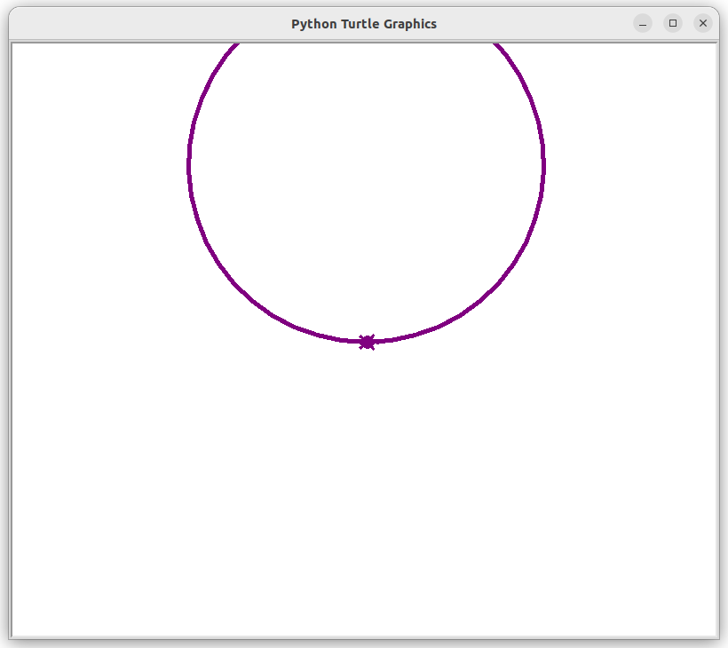<br />

❏ Next you'll fill in a shape with color. Start by adding the line `fillcolor('pink')` at the beginning of your code. You can swap in the name of a different color if you prefer. 

❏ Next, add the lines `begin_fill()` and `end_fill()` at the beginning and end of drawing a shape. Go to **Run > Run Module** in the toolbar or press **F5** to run your code.

```
from turtle import *
shape('turtle')
width(5)
color('purple')
fillcolor('pink')

begin_fill()
circle(200)
end_fill()
```

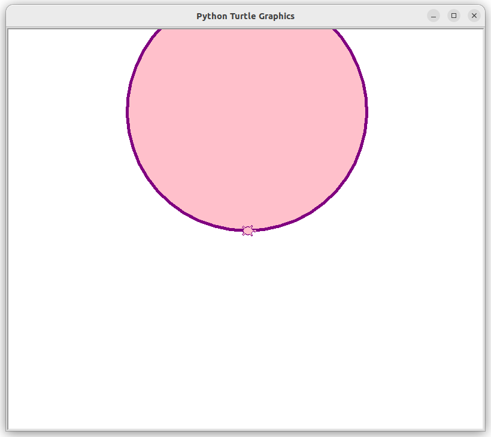<br />

❏ To set the background color for the whole canvas, you can use the `bgcolor()` function.

```
bgcolor('orange')
```

## ▶ Use a for loop

You can use a **for loop** to run the same piece of code as many times as you want.

Here's what a for loop looks like in Python. The line `for i in range(25):` starts the loop, and the **indented** lines underneath will run repeatedly. You can indent using a **tab** or **4 spaces**. The function `range(25)` specifies that the loop will run 25 times.

```
for i in range(25):
    begin_fill()
    circle(50-i)
    end_fill()
```

The first time this loop runs, the variable `i` will have the value `0`. The second time it runs, `i` will be `1`, etc. On the final iteration, `i` will equal `24`.

The code above draws a circle with `50-i` (fifty minus i) as the radius value every time the for loop runs.

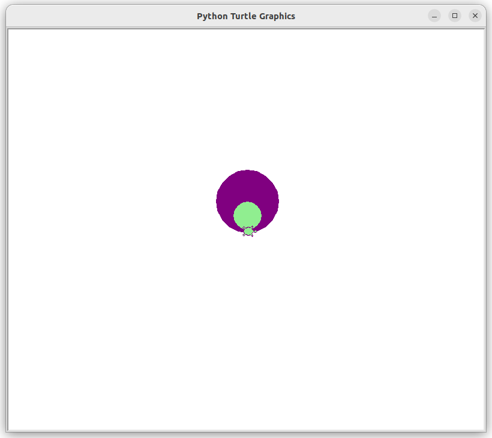<br />

<div style="page-break-after: always;"></div>

❏ The code below is an update on the previous for loop, starting with a radius of 150 and reducing it by `i*5` on each iteration. (In Python, `*` is the multiplication symbol.)

```
for i in range(25):
    begin_fill()
    circle(150-(i*5))
    end_fill()
```

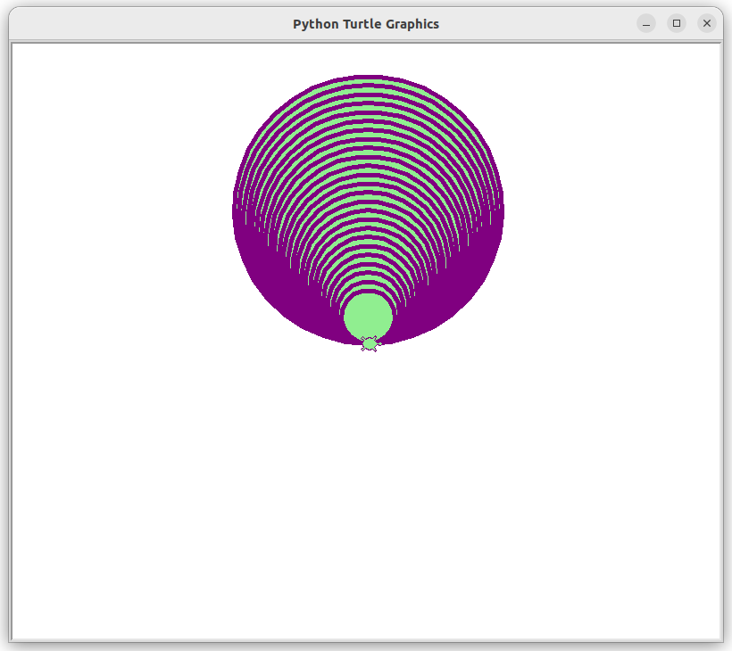<br />

<div style="page-break-after: always;"></div>

### 🐢 Mini challenge

**❏** ***Use a for loop with `penup()` and `pendown()` to make a dotted line.***

### 🐢 Mini challenge

**❏** ***Use a for loop to draw the same shape at a range of different angles.***

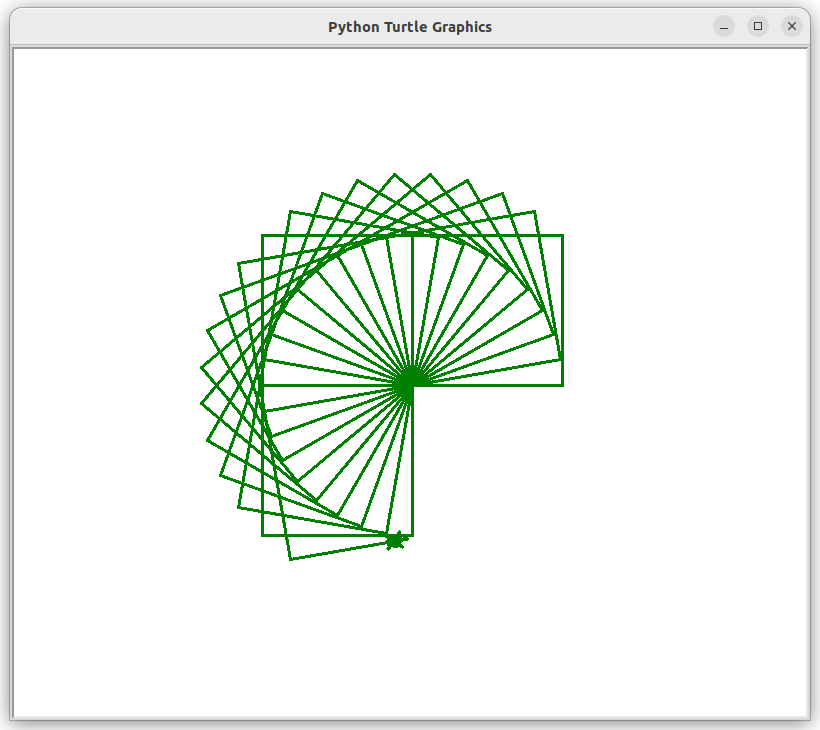<br />

<div style="page-break-after: always;"></div>

## ▶ An Example with Random Numbers

❏ If you want to use random numbers in your Python Turtle code, you'll need to include the line `import random` near the beginning.

The method `random.randint(1,360)` will return a random integer from 1 to 360, inclusive. You can put the whole function between the parentheses of a `left()` or `right()` function to choose an angle at random.

The code below also uses the `home()` function to return the turtle to its original position without erasing the drawing.

```
from turtle import *
import random
width(3)
color('purple')
bgcolor('lightyellow')

for i in range(70):
    penup()
    home()
    left(random.randint(1,360))
    forward(random.randint(30,250))
    pendown()
    for j in range(4):
        forward(30)
        left(90)
```

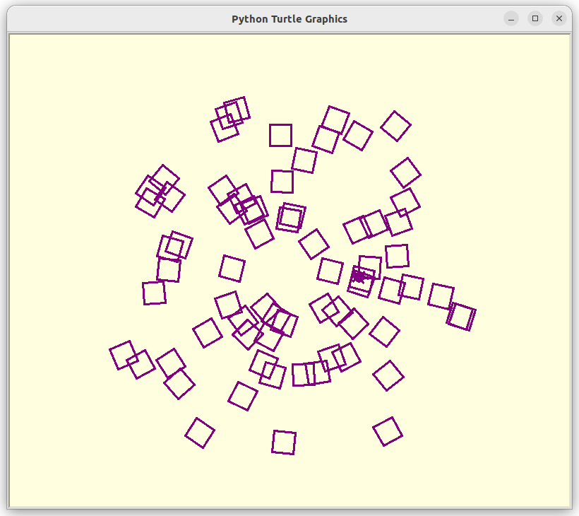<br />

If you want your turtle to draw faster, You can add the `speed()` function at the beginning of your program. The maximum speed is `9`.

```
speed(9)
```

To hide your turtle cursor so you can get a clean screenshot, use the `hideturtle()` function.

```
hideturtle()
```

## ▶ An Example with Random Colors

In the example below, we start by creating a list of color names and storing it as a variable called `color_list`. In addition to the color names we're using below, you can use hex-formatted colors such as `#01d6ae`.

Later in the code we use `random.choice(color_list)` to select a random color from the list, which is passed to the `fillcolor()` function to set the color of the current shape.

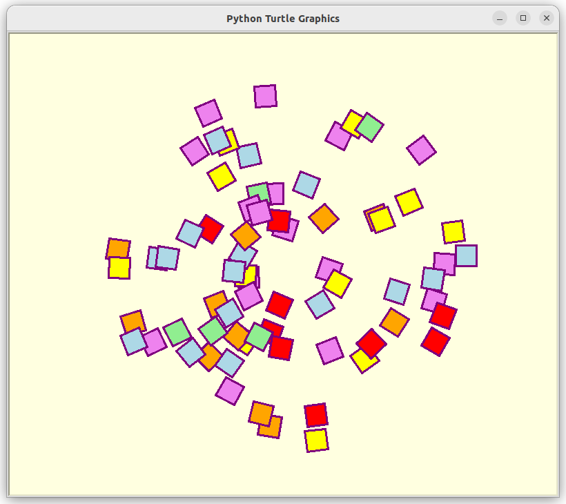

```
from turtle import *
import random
width(3)
color('purple')
bgcolor('lightyellow')
speed(9)

color_list = ['red','orange','yellow','lightgreen','lightblue','violet']

for i in range(70):
    penup()
    home()
    left(random.randint(1,360))
    forward(random.randint(30,250)
    pendown()
    fillcolor(random.choice(color_list))
    begin_fill()
    for j in range(4):
        forward(30)
        left(90)
    end_fill()

hideturtle()
```

The code above uses a for loop to draw each square, starting with the line `for j in range(4):`. Note that this loop is inside another for loop, so the code inside it is double indented.

<div style="page-break-after: always;"></div>

## 🐢 More Challenges

❏ Draw a house

❏ Draw a happy robot

❏ Draw a worm

❏ Draw a pentagon

❏ Draw an n-sided polygon

❏ Draw a 5-sided star

❏ Draw an n-sided star

❏ Draw a flower

❏ Draw a flower with n petals

❏ Write your name in cursive

❏ Draw a randomized night sky with shooting stars

❏ Draw a tree with random details

<div style="page-break-after: always;"></div>

## ▶ Using Python Turtle at Home

***Ubuntu instructions***

If you're using Ubuntu or a similar Debian-based Linux distro, run the following commands to install IDLE:

```
sudo apt-get update
sudo apt-get upgrade
sudo apt-get install idle
```

If you're using an older version of Ubuntu, you may also need to install the tkinter Python package:

```
sudo apt-get install python3-tk
```

***macOS instructions***

On Mac, open a terminal window and run `idle3` to see if IDLE is installed. 

If it isn't available, go to [https://brew.sh](https://brew.sh) and follow the instructions to install Homebrew. Then run the following commands to install Python3 and Tkinter:

```
brew install python3
brew install tkinter
```

Run the command `idle3` and you should be good to go.

***Windows instructions***

Coming soon!

<br/>
<br/>
<br/>

**Updated August 27, 2023**

You can find the latest version of this zine at the following URL: https://github.com/iffybooks/draw-with-code

Follow Iffy Books on Mastodon!

https://post.lurk.org/@iffybooks

Make a one-time or recurring donation:

https://iffybooks.net/donate

♥️ Thank you!

<div style="page-break-after: always;"></div>
