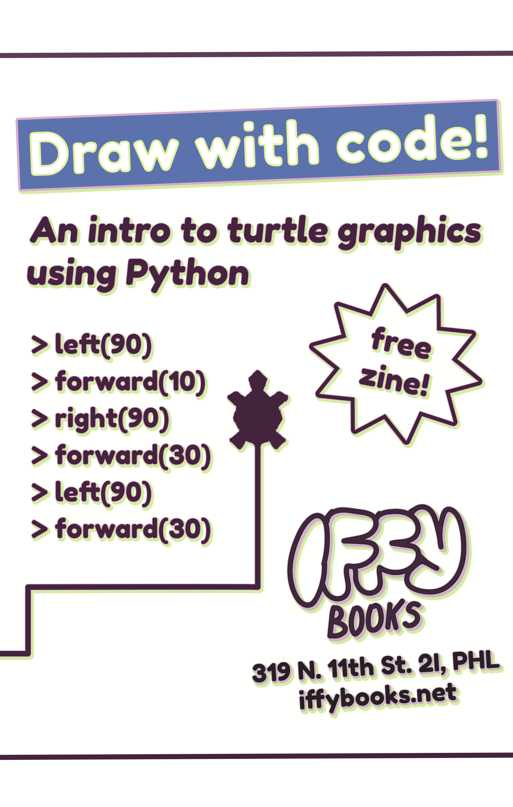
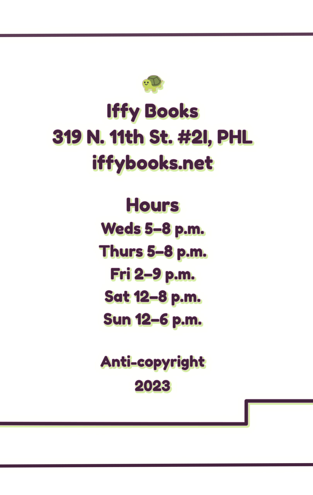

# Python Turtle is a drawing tool based on Logo, an educational programming language developed in the 1960s. Logo was used widely in school computer labs in the '80s and '90s.

Here's how it works: The user types lines of code to control a cursor onscreen, typically represented as a turtle. The turtle can draw lines and curves as it walks around, creating geometric art. The next step is to add a loop to your code, letting you repeat the instructions as many times as you want.

We'll be using Python, a programming language that comes preinstalled with many computer operating systems. Python is really cool! It's relatively easy to learn, and it's used widely by scientists, web developers, hackers, and just about everyone else.

In this workshop we'll be focusing on **turtle**, a module that comes built-in with Python.

We'll also use **IDLE**, a program that lets you write and run Python code.

At the Iffy Books computer lab we're using the Linux-based operating system **Ubuntu**. If you're getting started on your home computer, skip ahead to the section titled **<u>Using Python Turtle at Home</u>**. Once **Python 3**, **IDLE**, and **Tkinter** are installed, you can resume here.

## ➡️ Open IDLE

❏ Start by opening the **terminal** application. Click the grid icon at the bottom left corner of the screen and search for "terminal," or click the terminal icon in the application bar.


❏ Type the following command into the terminal and press **enter** to launch **IDLE**. When it launches, you'll see a command prompt with three angle brackets (**>>>**) on the left side.

```
idle
```

↳ If you're using macOS, you may need to use the command `idle3`instead.


## ➡ First Steps

❏ In the Idle command prompt, type the following command and press **enter**. Nothing will happen, which is normal. You've just imported a collection of tools from the `turtle` module.

```
from turtle import *
```


❏ Type the command below and press **enter**. You'll see a window pop up with a tiny turtle on a white background.

```
shape('turtle')
```


❏ Run this command to make the turtle walk forward 100 steps, leaving a line behind it:

```
forward(100)
```


❏ Now use this one to make it turn left 90 degrees.

```
left(90)
```

❏ Now make it walk forward another 100 steps:

```
forward(100)
```

❏ If you want to reset everything and go back to the beginning, you can use `reset()`.

```
reset()
```

### 🔎 What will happen?

❏ Try using `right(90)` and `back(100)` and see what happens. Now try `right(360)` and `back(600)`.

### 🐢 Mini challenge

**❏ *Drawing a square or rectangle.***

### 🐢 Mini challenge

**❏ *Draw an equilateral triangle (all three sides the same length).***

## ➡️ Pen Up and Pen Down

So far your turtle has been in **pen down** mode, which means it draws a line wherever it goes. Next you'll learn to use **pen up** mode to move around without leaving a mark. You'll also learn to draw **circles**.

❏ Run the `reset()` command to clear the canvas.

```
reset()
```

❏ Run the following command to make a circle with radius 30.

```
circle(30)
```

❏ Now run the following commands one at a time and watch what happens:

```
penup()
forward(100)
pendown()
circle(50)
```

### 🐢 Mini challenge

**❏ *Draw a series of circles that get smaller from left to right. If you make a mistake, you can use `reset()` to clear the canvas.***


## ➡️ Start editing a .py file

So far you've been running one line of code at a time, which is a good way to learn the basics. The next step is to write several lines of code and run them all at once. To do that, you'll need to store your code in a **.py** file.

❏ In the toolbar, go to **File > New File**.


❏ A new text editor window will pop up. Type the lines below, then select **Run > Run Module** in the toolbar.

```
from turtle import *
shape('turtle')
forward(100)
```


❏ You'll be prompted to save your file before running it. Click **OK**.


❏ Choose a filename and save your **.py** file somewhere memorable.


Once your file is saved, your turtle drawing will get started. 


Note that there's some text output in the IDLE shell window where you were typing commands earlier. If you get an error, you can check this window for details.


## ➡️ Change Colors & Line Width

```
from turtle import *
shape('turtle')
width(5)

circle(200)
```

```
from turtle import *
shape('turtle')
width(5)
color('purple')

circle(200)
```

```
from turtle import *
shape('turtle')
width(5)
color('purple')
fillcolor('pink')

begin_fill()
circle(200)
end_fill()
```

```
bgcolor('orange')
```

## ➡️ Use a for loop

```
for i in range(25):
    begin_fill()
    circle(50-i)
    end_fill()
```

```
for i in range(25):
    begin_fill()
    circle(150-(i*5))
    end_fill()
```

### 🐢 Mini challenge

**❏** ***Use a for loop with `penup()` and `pendown()` to make a dotted line.***

### 🐢 Mini challenge

**❏** ***Use a for loop to draw repeated shapes at a range of different angles.***

## ➡️ An Example with Random Numbers

[random rectangles]

## ➡️ An Example with Random Colors

[concentric circles]

## 

## ➡️ More Challenges

❏ Draw a pentagon

❏ Draw an n-sided polygon

❏ Draw a 5-sided star

❏ Draw an n-sided star

❏ Draw a flower

❏ Draw a flower with n petals

❏ Draw a house

❏ Draw a happy robot

❏ Draw a worm

❏ Write your name in cursive

❏ Draw a randomized night sky with shooting stars

❏ Draw a tree with random details

## ➡️ Read More

## ➡️ Using Python Turtle at Home

Ubuntu setup steps:

```
sudo apt-get update
sudo apt-get upgrade
sudo apt-get install idle
```

**Updated August 25, 2023**

You can find the latest version of this zine at the following URL: https://github.com/iffybooks/draw-with-code

Follow us on Mastodon!

https://post.lurk.org/@iffybooks


